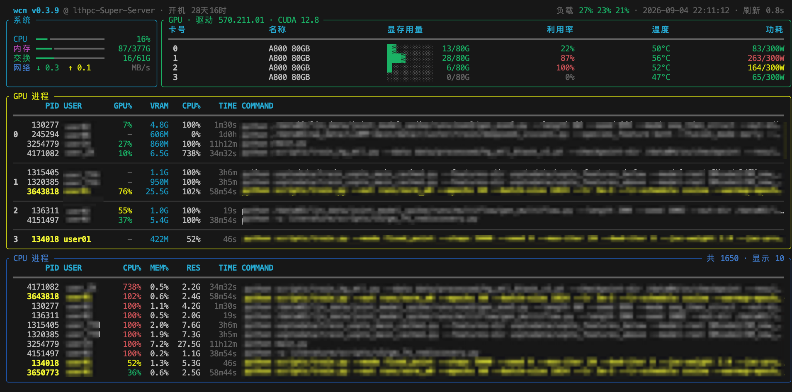

# wcn

终端里的 GPU + 系统监控,`top` 与 `nvidia-smi` 的合体。单个二进制,通过 NVML 直连显卡、读 `/proc` 取系统指标,Rust + [ratatui](https://github.com/ratatui/ratatui) 实现。

## 运行要求

- **Linux x86_64 + NVIDIA 驱动**:GPU 数据经驱动自带的 NVML 库读取,机器没装驱动就只显示系统面板。
- **glibc ≥ 2.17**:即 CentOS 7 / Ubuntu 14.04 及以后,主流发行版都满足。
  用 musl 的极简系统(如 Alpine)不支持——NVML 要动态加载,做不到全静态。
- 另需 `ps`(看进程,几乎所有系统自带)。

## 界面



- **顶栏**:版本 · 主机 · 开机时长 | **负载** · 时间 · 刷新率。
  负载是过去 **1/5/15 分钟**用掉了本机多少算力(已按核数换算成百分比,换机器不用心算);
  **>100% 表示有进程在排队等**。绿 <70%、黄 70~100%、红 >100%。
- **系统**:CPU 利用率、内存 用/总、(有 swap 时)交换、网速 ↓↑;进度条按阈值绿/黄/红。
  交换行:暗=空、黄=占着、红+`⇅`=**正在换页**(性能在被拖累)。
- **GPU 概览**:每卡 显存用量(条 + 用/总 GiB)、利用率、温度、功耗;标题带驱动/CUDA 版本。
  **温度 ≥85°C 高亮温度格,回落到 <82°C 才熄灭**(留迟滞,免得温度骑在阈值上反复闪)。
- **GPU 进程**:只列占着 GPU 的进程,按卡分组;`VRAM` 与上方概览同单位,便于直接对照。
- **CPU 进程**:按**瞬时** CPU% 降序(读 `/proc/<pid>/stat` 增量,非 ps 生命周期均值);
  `RES`=系统内存,`TIME`=进程存活时长。面板标题右端显示 `共 N · 显示 M`。
- **自己的进程**高亮:黄色只标**身份**列(PID / USER / COMMAND),指标列保持各自的语义色。
- 没有 NVIDIA 显卡的机器照常可用,GPU 相关面板会自动省去。

## 按键

| 键 | 作用 |
|----|------|
| `u` | **只看自己的进程**,再按一次看全部 |
| `/` | **搜索**:输入用户名或命令关键词(如 `python`),回车确认、`Esc` 取消 |
| `Esc` | 清除筛选 |
| `c` | 切到 / 切回 **CPU 单页**(只看 CPU 进程,铺满高度,多一列 `SWAP` 定位谁在占交换) |
| `r` | 反序(**仅 CPU 单页**:CPU% 降序 ⇄ 升序) |
| `p` | **定格 / 继续**(冻结画面与时钟,显示 `⏸ 已暂停`) |
| `q` / `Ctrl-C` | 退出 |

> 筛选只作用于 **CPU 进程**表(筛选中面板边框变黄);GPU 进程表始终显示全部——
> 共享机上「别人占了多少显存」恰恰最该看见。

## 安装 / 更新 / 卸载

装好之后,后续直接用自带子命令:

```bash
wcn update      # 更新到最新版(就地替换,原位置不变)
wcn uninstall   # 卸载(会先确认)
```

**首次安装**一行搞定(这条也可随时重跑当更新用):

```bash
curl -fsSL https://raw.githubusercontent.com/Passion4ever/wcn/main/install.sh | bash
```

脚本会检查环境、自动选安装目录(能写 `/usr/local/bin` 就全局,否则 `~/.local/bin`)、
已是最新则跳过;更新用原子替换,`wcn` 正开着也能换。

访问 GitHub 需要代理时:

```bash
curl -fsSL https://raw.githubusercontent.com/Passion4ever/wcn/main/install.sh \
  | HTTPS_PROXY=socks5://127.0.0.1:1080 bash
```

不想跑脚本,手动装也行:

```bash
curl -fsSL https://github.com/Passion4ever/wcn/releases/latest/download/wcn -o wcn
chmod +x wcn && mv wcn ~/.local/bin/        # 或 sudo mv wcn /usr/local/bin/
```

目标机连不上 GitHub,就在能联网的机器上下载后 `scp` 过去。
预编译二进制按 glibc 2.17 链接,满足「运行要求」的主流 Linux 直接跑。查版本:`wcn --version`。

## 许可

个人自用,MIT。
